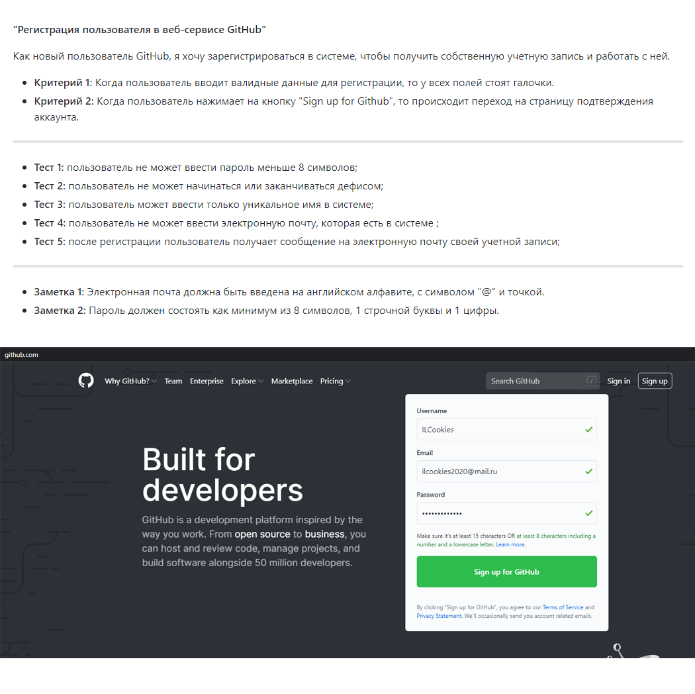

# Методические рекомендации к составлению пользовательской истории

##  Основные термины 

| Номер | Понятие | Определение |
| --- | --- | ---|
| 1 | Пользовательская история | Способ описания требований к разрабатываемой системе, сформулированных как одно или более предложений на повседневном или деловом языке пользователя. |
| 2 | Критерии приемки | Конкретные требования к истории, которые должны быть выполнены, чтобы история была завершена.  |
| 3 | Жизненный цикл программного обеспечения | Период времени, который начинается с момента принятия решения о необходимости создания программного продукта и заканчивается в момент его полного изъятия из эксплуатации. |
| 4 | Техническое задание| Основополагающий документ, которым руководствуются разработчики и проектировщики, приступая к разработке нового изделия.  |
| 5 | Тестовый план | Документ, описывающий весь объем работ по тестированию, начиная с описания объекта, стратегии, расписания, критериев начала и окончания тестирования, до необходимого в процессе работы оборудования, специальных знаний, а также оценки рисков с вариантами их разрешения. |
| 6 | Функциональные тесты | Тесты, основанные на проверке соответствий функциональных требований ПО к его реальным характеристикам. |

## Перечень условных обозначений и сокращений 

| Аббревиатура | Пояснение |
| --- | --- |
| User Story | Пользовательская история |
| Acceptance Criteria | Критерии приемки |
| ПО | Программное обеспечение |
| ТЗ | Техническое задание |

## Общая информация к составлению пользовательских историй 

Настоящие методические рекомендации определяют порядок составления  пользовательских историй. 

**Цель документа:** создать наиболее эффективные, рациональные варианты написания User Story. 

## Требования к заголовку

**1) Заголовок должен содержать идентификатор;**

У каждой пользовательской истории есть свой порядковый номер. Поэтому для структурированности документов и для правильного ветвления на больших проектах заголовок должен иметь следующий шаблон:

**[STORY-Порядковый номер User Story] "Название"**

**Пример:**

[STORY-1] Владелец карты снимает наличные с банкомата

**2) Заголовок должен описывать действие;**

Для примера возьмем операцию снятия наличных с банкомата. 

Заголовок истории описывает действие, которое хочет осуществить владелец карты: "Владелец карточки снимает наличку".

Пока мы не реализовали это функцию - владелец карты не может снять наличку в банкомате. А когда мы её реализуем - он сможет. Это даёт нам представление о том, что значит "Готово" для данной пользовательской истории - то есть как будет выглядеть ***конечный результат***.

**3) Заголовок истории должен всегда описать реальное взаимодействие человека с системой;**

Также возьмем эту же ситуацию, когда владелец карты снимает наличные с банкомата, но назовем ее по-другому: "Поведение банкомата".
В данном случае нам сложно понять о чем наша история, так как границы очень расплывчаты.

"Поведение банкомата" должно описывать не только процесс снятия наличных, но и , к примеру, смену пин-кода на карточке.

**4) Заголовок сценария должен фокусироваться на отличиях в ситуациях;**

Если вы расположите сценарии горизонтально рядом друг с другом - вы должны будете чётко объяснить, в чём их различие, причём глядя только на заголовок. Но не нужно писать: "Владелец карты снимает с неё деньги при этом на карточке недостаточно средств и ему сообщают о том, что невозможно выполнить транзакцию". 

***Из заголовка должно быть понятно, чем эта конкретная ситуация отличается от других.*** 

## Требования к атрибутам

**INVEST — аббревиатура из первых букв предлагаемых к рассмотрению атрибутов качества пользовательских историй.**

**I** - Independent (независимая)

* Пользовательская история может быть реализована, протестирована и доставлена независимо от других пользовательских историй. Реализуемая часть функционала удовлетворяет какую-то потребность и является ценным для бизнеса.

**N** - Negotiable (обсуждаемая)

* Одно из отличий других видов требований от пользовательских историй заключается в том, что пользовательская история на начальном этапе не является конечным требованием или договоренностью, а тем — что необходимо обсудить и реализовать. Пользовательская история отражает суть, а не детали. Со временем карточка пользовательской истории может быть расширена, но все дополнения — это всего лишь детали, которые улучшают понимание сути пользовательской истории или обеспечивают процесс ее тестирования.

**V** - Valuable (полезная)

* Один из самых важных атрибутов модели.
***Главная цель проекта по разработке продукта или системы*** — обеспечение ценности продукта/системы посредством предоставления решений проблем или удовлетворения потребностей.
В процессе написания историй думайте о них как о частях продукта/системы, которые в совокупности обеспечивают достижение главной цели проекта.

**E** - Estimable (оцениваемая)

* Хорошую пользовательскую историю можно оценить по критериям сложности и трудозатрат для ее реализации. Здесь речь идет не о точной оценке, а о приблизительной.
Если историю невозможно оценить, то это значит, что она либо большая, либо неопределенная. В обоих случаях пользовательскую историю следует пересмотреть.

**S** - Small (маленькая, компактная)

* Хорошая пользовательская история — компактная и реализуемая в рамках одной итерации. В противном случае она не будет представлять ценности по окончании итерации.

**T** - Testable (тестируемая)

* Хорошая пользовательская история может быть протестирована, то есть для нее можно написать критерии приемки.

## Пункты, из которых должен состоять документ

**1) Заголовок;**

Описание истории в одну строку.
 
**2) Формулировка истории;**

Как, **РОЛЬ** <пользователь>, я <что-то хочу получить> **ДЕЙСТВИЕ**, <с такой-то целью> **ЦЕННОСТЬ**

***Роль:*** Это пользователи или группы пользователей, например: Пользователь, Гость, Оператор и Администратор.

***Действие:*** Это суть истории, "что нужно сделать". Действие должно быть одно — основное. Укажите то действие, что вам действительно нужно.
Важно описывать историю на уровне "ЧТО?" делает, а не "КАК?" Это главное в истории. Опишите проблему, а не ее решение.

***Ценность:*** Ваша история обязательно должна иметь ценность (результат), обязательно должна оказывать влияние на кого-то. Это влияние ведет в конечном итоге к цели, которая имеет для вас ценность.

**3) Критерии приемки;**

Критерии по которым мы поймем, что история завершена.

**Шаблон критериев приёмки:**

Учитывая ***[контекст],*** когда ***[выполняется конкретное действие],*** тогда (то) ***[должно произойти следствие]***

**Пример:**  

Когда пользователь заходит в карточку сотрудника, то видит пустые поля ввода.

**Требования Acceptance Criteria для пользовательской истории:**

* Acceptance Criteria должно быть написано с точки зрения пользователя.

* Критерии должны быть четкими, краткими, понятными.

* Acceptance Criteria не о том «как». Это о том «что».

* Acceptance Criteria может быть повторением User Story с точки зрения пользователя.

**4) Тестирование;**

В идеальном случае пользовательские истории служат еще и легковесной тестовой документацией, в которой фиксируются тест кейсы.

**5) Технические заметки;**

Сюда часто попадает информация об ограничениях системы, к примеру, о необходимости поддерживать определенный формат данных.
 
## Критерии приемлемости каждого пункта.

## Роль документа в жизненном цикле ПО

1) При составлении User Story может уточнять техническое задание;

2) User Story составляется планомерно на жизненном цикле ПО по мере необходимости;

3) Задача поднимается на кодирование и тест-дизайн;

4) Разрабатываются тестовые сценарии;

**ВАЖНО:** После тестирования мы должны ответить на вопрос: "Есть ли в User Story то, что накодировали разработчики?"

## Документы, которые должны быть изменены и созданы на основании пользовательской истории. 

* Техническое задание - может быть изменено разработчиками;

* Для хранения User Story должна быть выделена папка по следующему шаблону:

**Student-timetable / Docs / Technical / UserStories / US_"Порядковый номер истории"**

* В конечной папке должен находиться отчёт с названием: **README.md**

* Также в конечной папке должны находиться изображения по шаблону: **"Порядковый номер изображения".png**

**Пример оформления документов:**

## Отсылки на метки

### Метки определяющие тип задачи/запроса

* `User Story` - Задача/запрос на составление пользовательской истории.

### Метки определяющие класс сущности

В библиотеке имеется следующий список сущностей.

- `AcademicDegree` - Ученая степень

- `AcademicLoad` - Академическая нагрузка

- `Auditor` - Аудитория

- `DirectionOfPreparation` - Направление подготовки

- `Discipline` - Дисциплина

- `Enclosures` - Корпус

- `Group` - Группа

- `HEI` - ВУЗ

- `Institute` - Институт

- `StudyWeek` - Учебная неделя

- `Teacher` - Преподаватель

- `Title` - Ученое звание

- `TrainingProfiles` - Профиль подготовки

- `TypesOfOccupations` - Вид занятия

- `University` - Университет

Для каждой сущносости реализован класс контроллер, выполняющий роль таблицы и класс модель, выполняющий роль строки в таблице.
Класс констроллер начинается с буквы `C` и образует название класса `CИмяСущности`. Класс модель начинается с буквы `M` и образует название класса `MИмяСущности`.

### Комбинации меток

- в месте с меткой `User Story` должна указываться метка составления документации `Documentation`.
