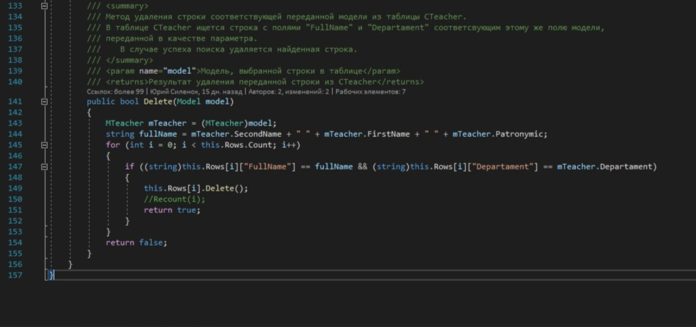
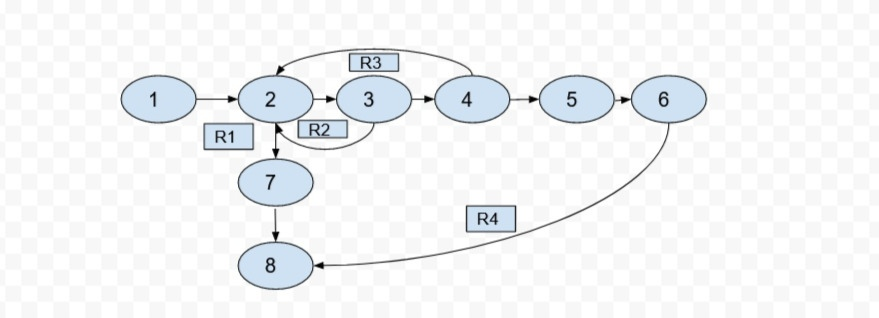

# Тестируемый метод

# Управляющий граф

# Маршруты на основании управляющего графа
R1 = 1 - 2 - 7 - 8

R2 = 1 - 2 - 3 - 2 - 7 - 8

R3 = 1 - 2 - 3 - 4 - 2 - 7 - 8

R4 = 1 - 2 - 3 - 4 - 5 - 6 - 8

# Тестовые сценарии

| Регион | Test ID | Идея | Предварительное условие | Входные параметры | Ожидаемый результат | 
| --- | --- | --- | --- | --- | --- |
| R1 | task-1281-1 | Удаление сведений в пустой таблице | Таблица преподавателей пуста | FirstName = "Чередникова", SecondName = "Алла",  Patronymic = "Викторовна" | false |
| R2 | task-1281-2 | Удаление несуществующего преподавателя | FirstName = "Чередникова", SecondName = "Алла",  Patronymic = "Викторовна" | FirstName = "Чередникова", SecondName = "Алла",  Patronymic = "Викторовна" | false |
| R3 | task-1281-3 | Корректное удаление преподавателя |  FirstName = "Прядкина", SecondName = "Нина",  Patronymic = "Олеговна" | FirstName, SecondName, FullName, Departament | true |
| R4 | task-1281-4 | Некорректное удаление преподавателя |  FirstName = "Прядкина", SecondName = "Нина",  Patronymic = "Олеговна" | FirstName = "Прядкина", SecondName = "Нина",  Patronymic = "Олеговна" | false |                     
