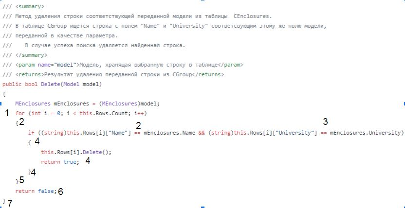
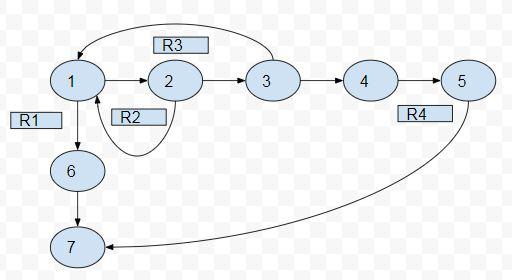

# Тестируемый метод

# Управляющий граф

# Маршруты на основании управляющего графа.

R1 = 1 - 6 - 7

R2 = 1 - 2 - 1 - 6 - 7

R3 = 1 - 2 - 3 - 1 - 6 - 7

R4 = 1 - 2 - 3 - 4 - 5 - 7

# Таблица тестирования 
| Регион | Test ID | Test title | RefData | Input value | Expected result | Actual result | Test status (Passed/Failed)|
| --- | --- | --- | --- | --- | --- | --- | --- |
| R1 | Task_395_1 | try to delete from empty table | empty | “Name”:“Я” “University”:”Костьомкой Госуьарственный Унивеьситет” "Address":"Дзержинского" "Phone":"112111" "Comment" "8" | false | false | Passed|
| R2 | Task_395_2 | check of difference in Name | “Name”:“Я” “University”:”Костьомкой Госуьарственный Унивеьситет” "Address":"Дзержинского" "Phone":"112111" "Comment" "8" | “Name”:“М” “University”:”Костьомкой Госуьарственный Унивеьситет” "Address":"Дзержинского" "Phone":"112111" "Comment" "8" | false | false | Passed|
| R3 | Task_395_3 | check of difference in University | “Name”:“Я” “University”:”Костьомкой Госуьарственный Унивеьситет” "Address":"Дзержинского" "Phone":"112111" "Comment" "8" | “Name”:“Я” “University”:”Цостьомкой Госуьарственный Унивеьситет” "Address":"Дзержинского" "Phone":"112111" "Comment" "8" | false | false | Passed|
| R4 | Task_395_4 | correct execution of code |  “Name”:“Я” “University”:”Костьомкой Госуьарственный Унивеьситет” "Address":"Дзержинского" "Phone":"112111" "Comment" "8" | “Name”:“Я” “University”:”Костьомкой Госуьарственный Унивеьситет” "Address":"Дзержинского" "Phone":"112111" "Comment" "8" | true | true | Passed|

# Вывод
Метод Delete может удалить или не удалить данные из таблицы - это зависит от входных данных. Тестирование “белым ящиком” позволяет проверить оба варианта метода. Большинство ошибок возникает из-за вводимых данных, поэтому требуется несколько однотипных тестов, проверяющих совпадение данных в таблице и входных данных.
