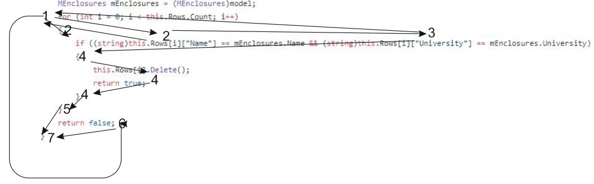

# Тестируемый метод

# Управляющий граф

# Маршруты на основании управляющего графа.

R1 = 1 - 6 - 7

R2 = 1 - 2 - 1 - 6 - 7

R3 = 1 - 2 - 3 - 1 - 6 - 7

R4 = 1 - 2 - 3 - 4 - 5 - 7

# Таблица тестирования 
| Регион | Test ID | Test title | RefData | Input value | Expected result | Actual result | Test status (Passed/Failed)|
| --- | --- | --- | --- | --- | --- | --- | --- |
| R1 | Task_395_2 | check that table isn’t empty | empty | “Name”:“E” “University”:”KGU” | false | false | Passed|
| R2 | Task_395_22 | check of difference in Name | “Name”:“E” “University”:”KGU” | “Name”:“A” “University”:”KGU” | false | false | Passed|
| R3 | Task_395_23 | check of difference in University | “Name”:“E” “University”:”KGU” | “Name”:“E” “University”:”KGA” | false | false | Passed|
| R4 |  Task_395_21 | correct execution of code |  “Name”:“E” “University”:”KGU” | “Name”:“E” “University”:”KGU” | true | true | Passed|

# Вывод
Метод Delete может удалить или не удалить данные из таблицы - это зависит от входных данных. Тестирование “белым ящиком” позволяет проверить оба варианта метода. Большинство ошибок возникает из-за вводимых данных, поэтому требуется несколько однотипных тестов, проверяющих совпадение данных в таблице и входных данных.
