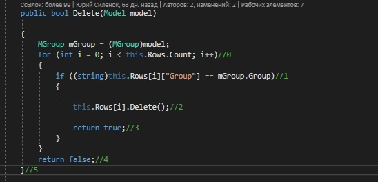
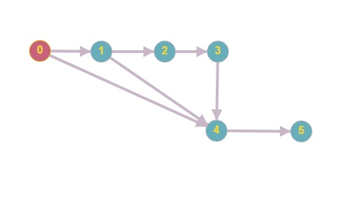

# Тестируемый метод

# Управляющий граф

# Маршруты на основании управляющего графа.

R1 = 0 - 1 - 2 - 6 - 7

R2 = 0 - 1 - 2 - 3 - 6 - 7 

R3 = 0 - 1 - 2 - 3 - 4 - 5 - 7   

# Тестовые сценарии
|Регион|Тест ID|Идея теста|Предварительное условие|Входные параметры|Ожидаемый результат|
