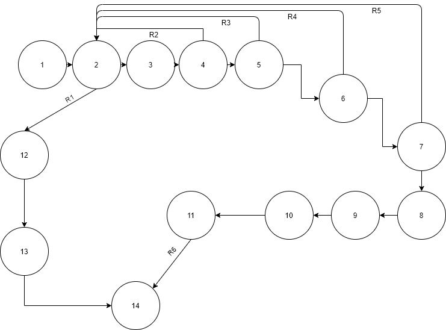

# Тестируемый метод

# Управляющий граф

# Маршруты на основании управляющего графа.

R1 = 0-1-2-12-13-14

R2 = 0-1-2-3-4-2-12-13-14

R3 = 0-1-2-3-4-5-2-12-13-14

R4 = 0-1-2-3-4-5-6-2-12-13-14

R5 = 0-1-2-3-4-5-6-7-2-12-13-14

R6 = 0-1-2-3-4-5-7-8-9-10-11-14

# Тестовые сценарии
|Регион|Test ID|Идея теста|Предварительное условие|Входные параметры|Ожидаемый результат|
| --- | --- | --- | --- | --- | --- |
|R1|617_1|Удалить строку в пустой таблице| Таблица институтов пуста | FullName = "Институт Автоматизированных Систем и Технологий" ShortName = "ФАСТ" Director = "Лустгартен Юрий Леонидович" VUS = "Костромской Государственный Университет" |false|
|R2|617_2|Удалить несуществующее короткое название института в таблице| FullName = "Институт Автоматизированных Систем и Технологий" ShortName = "ФАСТ" Director = "Лустгартен Юрий Леонидович" VUS = "Костромской Государственный Университет" | FullName = "Институт Автоматизированных Систем и Технологий" ShortName = "ФАСТЙ" Director = "Лустгартен Юрий Леонидович" VUS = "Костромской Государственный Университет" |false|
|R3|617_3|Удалить несуществующее полное название института в  таблице| FullName = "Институт Автоматизированных Систем и Технологий" ShortName = "ФАСТ" Director = "Лустгартен Юрий Леонидович" VUS = "Костромской Государственный Университет" | FullName = "Институтй Автоматизированныхй Системй и Технологийй" ShortName = "ФАСТ" Director = "Лустгартен Юрий Леонидович" VUS = "Костромской Государственный Университет" |false|
|R4|617_4|Удалить несуществующего директора в  таблице|FullName = "Институт Автоматизированных Систем и Технологий" ShortName = "ФАСТ" Director = "Лустгартен Юрий Леонидович" VUS = "Костромской Государственный Университет" | FullName = "Институт Автоматизированных Систем и Технологий" ShortName = "ФАСТ" Director = "Лустгартенй Юрийй Леонидовичй" VUS = "Костромской Государственный Университет" | false|
|R5|617_5|Удалить несуществующее ВУЗ в таблице| FullName = "Институт Автоматизированных Систем и Технологий" ShortName = "ФАСТ" Director = "Лустгартен Юрий Леонидович" VUS = "Костромской Государственный Университет" | FullName = "Институт Автоматизированных Систем и Технологий" ShortName = "ФАСТ" Director = "Лустгартен Юрий Леонидович" VUS = "Костромскойй Государственныйй Университетй" |false| 
|R6|617_6|Удалить корректную строку| FullName = "Институт Автоматизированных Систем и Технологий" ShortName = "ФАСТ" Director = "Лустгартен Юрий Леонидович" VUS = "Костромской Государственный Университет" | FullName = "Институт Автоматизированных Систем и Технологий" ShortName = "ФАСТ" Director = "Лустгартен Юрий Леонидович" VUS = "Костромской Государственный Университет" | true |
# Вывод
Метод тестирования “Белый ящик” помог более наглядно рассмотреть структуры построения дисциплины и стал полезен для тщательного тестирования и обнаружения проблем. 
Оптимизация кода стала более легкой и тестирование прошло успешно.
