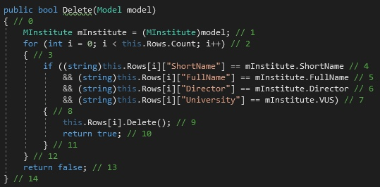

# Тестируемый метод

# Управляющий граф

# Маршруты на основании управляющего графа.

R1 = 0-1-2-3-4-5-7
R2 = 0-1-2-6-7

# Тестовые сценарии
|Регион|Идея теста|Входные параметры|Ожидаемый результат|
| --- | --- | --- | --- |
|R1|Верные входные данные, удаление данных при полном совпадении модели| FullName = "Какой то левый институт не наш" ShortName = "ФАСТ" Director = "Лустгартен Юрий Леонидович" VUS = "Костромской Государственный Университет" | true |
|R2 (1 случай)|Неверные входные данные, неудаление данных при несовпадении атрибута Краткое название|FullName = "Любой институт" ShortName = "ИАСТ" Director = "Иванов Ю.Л." VUS = "Политехнический колледж"|false|
|R2 (2 случай)|Неверные входные данные, неудаление данных при несовпадении атрибута Полное название|FullName = "Институт автоматизированных систем и технологий" ShortName = "ФАСТ" Director = "Иванов Ю.Л." VUS = "Политехнический колледж"|false|
|R2 (3 случай)|Неверные входные данные, неудаление данных при несовпадении атрибута Директор|FullName = "Любой институт" ShortName = "ФАСТ" Director = "Лустгартен Ю.Л." VUS = "Политехнический колледж"|false|
|R2 (4 случай)|Неверные входные данные, неудаление данных при несовпадении атрибута Наименование ВУЗа|FullName = "Любой институт" ShortName = "ФАСТ" Director = "Иванов Ю.Л." VUS = "Костромской Государственный Университет"|false|
|R2 (5 случай)|Неверные входные данные, неудаление данных при попытке удаления несуществующих данных FullName = "Любой институт" ShortName = "ФАСТ" Director = "Иванов Ю.Л." VUS = "Политехнический колледж"|false|

# Вывод
Метод тестирования “Белый ящик” помог более наглядно рассмотреть структуры построения дисциплины и стал полезен для тщательного тестирования и обнаружения проблем. 
Оптимизация кода стала более легкой и тестирование прошло успешно.
