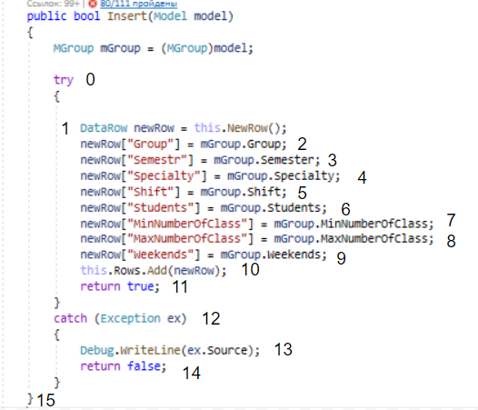
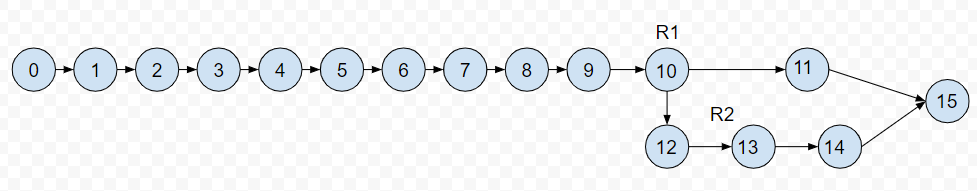

# Тестируемый метод

# Управляющий граф

# Маршруты на основании управляющего графа.
R1 = 0 - 1 - 2 - 3 - 4 - 5 - 6 - 7 - 8 - 9 - 10 - 11 - 15

R2 = 0 - 1 - 2 - 3 - 4 - 5 - 6 - 7 - 8 - 9 - 10 - 12 - 13 - 14 - 15

# Тестовые сценарии
|Регион|Test ID|Test title|Input value|Expected result|Actual result|Test status|
| --- | --- | --- | --- | --- | --- | --- |
|R1| 251_1 |Добавить новые корректные данные в таблицу.|-Группа: "17-ИСбо-2д" -Семестр: "1" -Направление подготовки: "ПРОФ" -Смена: "1" -Студентов: "1" -Пар/день min: "0" -Пар/день max: "0" -Выходные: "Воскресенье"|true|true|Passed|
|R2| 251_2 |Добавление корректных данных, при условии, что Группа добавляемой группы дублирует Группа уже существующей группы.|-Группа: "17-ИСбо-2а" -Семестр: "2" -Направление подготовки: "ИСиТД" -Смена: "2" -Студентов: "2" -Пар/день min: "1" -Пар/день max: "1" -Выходные: "Суббота"|false|false|Passed|
|R1| 251_3 |Добавление корректных данных, при условии, что Семестр добавляемой группы дублирует Семестр уже существующей группы.|-Группа: "17-ИДбо-2б" -Семестр: "1" -Направление подготовки: "НЕПРОФ" -Смена: "2" -Студентов: "2" -Пар/день min: "1" -Пар/день max: "1" -Выходные: "Суббота"|true|true|Passed|
|R1| 251_4 |Добавление корректных данных, при условии, что Направление подготовки добавляемой группы дублирует Направление подготовки уже существующей группы.|-Группа: "17-ИДбо-2б" -Семестр: "2" -Направление подготовки: "ПРОФ" -Смена: "2" -Студентов: "2" -Пар/день min: "1" -Пар/день max: "1" -Выходные: "Суббота"|true|true|Passed|
|R1| 251_5 |Добавление корректных данных, при условии, что Смена добавляемой группы дублирует Смена уже существующей группы.|-Группа: "17-ИДбо-2б" -Семестр: "2" -Направление подготовки: "НЕПРОФ" -Смена: "1" -Студентов: "2" -Пар/день min: "1" -Пар/день max: "1" -Выходные: "Суббота"|true|true|Passed|
|R1| 251_6 |Добавление корректных данных, при условии, что Студентов добавляемой группы дублирует Студентов уже существующей группы.|-Группа: "17-ИДбо-2б" -Семестр: "2" -Направление подготовки: "НЕПРОФ" -Смена: "2" -Студентов: "1" -Пар/день min: "1" -Пар/день max: "1" -Выходные: "Суббота"|true|true|Passed|
|R1| 251_7 |Добавление корректных данных, при условии, что Пар/день min добавляемой группы дублирует Пар/день min уже существующей группы.|-Группа: "17-ИДбо-2б" -Семестр: "2" -Направление подготовки: "НЕПРОФ" -Смена: "2" -Студентов: "2" -Пар/день min: "0" -Пар/день max: "1" -Выходные: "Суббота"|true|true|Passed|
|R1| 251_8 |Добавление корректных данных, при условии, что Пар/день max добавляемой группы дублирует Пар/день max уже существующей групп.|-Группа: "17-ИДбо-2б" -Семестр: "2" -Направление подготовки: "НЕПРОФ" -Смена: "2" -Студентов: "2" -Пар/день min: "1" -Пар/день max: "0" -Выходные: "Суббота"|true|true|Passed|
|R1| 251_9 |Добавление корректных данных, при условии, что Выходные добавляемой группы дублирует Выходные уже существующей группы.|-Группа: "17-ИДбо-2б" -Семестр: "2" -Направление подготовки: "НЕПРОФ" -Смена: "2" -Студентов: "2" -Пар/день min: "1" -Пар/день max: "1" -Выходные: "Воскресенье"|true|true|Passed|
|R1| 251_10 |Добавление корректных данных, при условии, что они не дублируют атрибуты уже существующей группы.|-Группа: "17-ИДбо-2б" -Семестр: "2" -Направление подготовки: "НЕПРОФ" -Смена: "2" -Студентов: "2" -Пар/день min: "1" -Пар/день max: "1" -Выходные: "Суббота"|true|true|Passed|

# Вывод: 
Метод Insert либо добавляет данные в таблицу, либо не добавляет их, по какой-то причине. Тестирование “белый ящик”, позволяет проверить оба варианта работы метода, но большинство ошибок происходит из-за проблем с вводимыми данными и поэтому необходимо несколько однотипных тестов, реализующих добавление разных вариантов данных. Поэтому число тестов, для проверки функционала может быть значительным.
