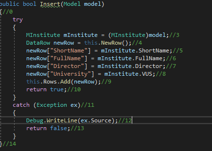
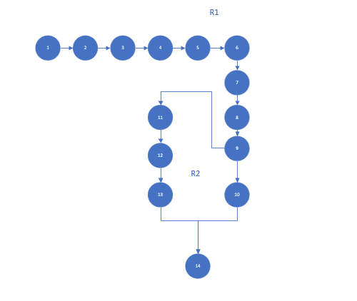

# Тестируемый метод

# Управляющий Граф

# Маршруты на основании управляющего графа
### R1 1, 2, 3, 4, 5, 11, 12, 13, 14
### R2 1, 2, 3, 4, 5, 6, 7, 8, 9, 11, 12, 13, 14

# Таблица тестирования
| Region | Test ID | Test title| Ref Data| Inpute value | Expected result | Actual result | Test status (Passed/Failed) |
| --- | --- | --- | --- | --- | --- | --- | --- |
| R1 | Task_616_1 | Все строки не имеют дубликатов в таблице  | Raws empty | Shortname=”ИАСТ” FullName=”Институт Автоматизированных Систем и технологий”  Director=”Лустгартен Ю.Л.” VUS=”КГУ” | true |
| R2 | Task_616_2 | Строка ShortName является дубликатом уже существующей записи в таблице | Shortname=”ИАСТ” FullName=”Институт Автоматизированных Систем и технологий”  Director=”Лустгартен Ю.Л.” VUS=”КГУ” | Shortname=”ИАСТ” FullName=”Институт Автоматических Светских Тем” Director=”Петров В.В.” VUS=”КГУ”	 | false |
| R2 | Task_616_3 | Строка FullName  является дубликатом уже существующей записи в таблице | Shortname=”ИАСТ” FullName=”Институт Автоматизированных Систем и технологий”  Director=”Лустгартен Ю.Л.” VUS=”КГУ” | Shortname=”ИПР” FullName=”Институт Автоматических систем и технологий” Director=” Лустгартен” VUS=”КГУ” | false |
| R2 | Task_616_4 | Строка Director уже используется в качестве Director в другой записи Institute | Shortname=”ИАСТ” FullName=”Институт Автоматизированных Систем и технологий”  Director=”Лустгартен Ю.Л.” VUS=”КГУ” | Shortname=”ИКИ” FullName=”Институт Кулитуры и Искуства” Director=”Лустгартен Ю.Л. ”VUS=”КГУ” | false |

