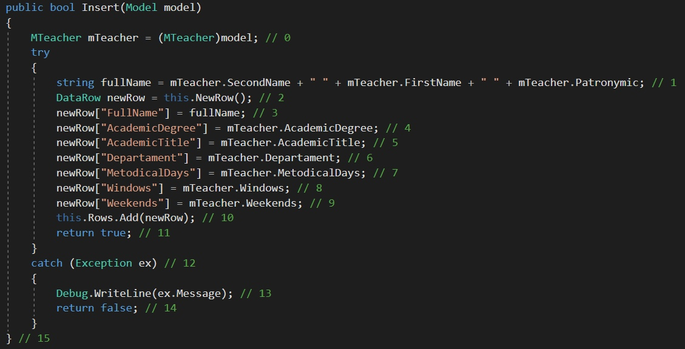
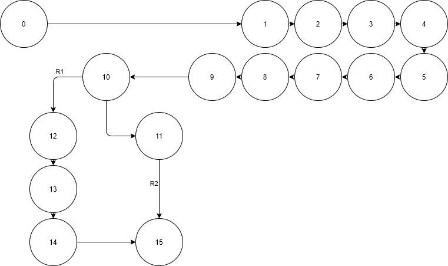

# Тестируемый метод

# Управляющий граф

# Маршруты на основании управляющего графа.

R1 = 0-1-2-3-4-5-6-7-8-9-10-12-13-14-15

R2 = 0-1-2-3-4-5-6-7-8-9-10-11-15

# Тестовые сценарии
|Регион|Test ID|Идея теста|Предварительное условие|Входные параметры|Ожидаемый результат|
| --- | --- | --- | --- | --- | --- |
|R1|246_1| Добавить преподавателя с некорректной ученой степенью | "Киприна", "Людмила", "Юрьевна", "Кандидат наук", "Доцент", "ФАСТ", "Пн, Вт", "Ср, Чт, Пт", "Воскресенье" | "Киприна", "Людмила", "Юрьевна", "Кандидат наук", "Дуцент", "ФАСТ", "Пн, Вт", "Ср, Чт, Пт", "воскресенье" | false |
|R1|246_2| Добавить преподавателя с некорректным ученым званием | "Киприна", "Людмила", "Юрьевна", "Кандидат наук", "Доцент", "ФАСТ", "Пн, Вт", "Ср, Чт, Пт", "Воскресенье" | "Киприна", "Людмила", "Юрьевна", "Канд наук", "Доцент", "ФАСТ", "Пн, Вт", "Ср, Чт, Пт", "воскресенье" | false |
|R1|246_3| Добавление несуществующего преподавателя | "Киприна", "Людмила", "Юрьевна", "Кандидат наук", "Доцент", "ФАСТ", "Пн, Вт", "Ср, Чт, Пт", "Воскресенье" | "Кипруна", "Лудмила", "Юрьувна", "Кандидат наук", "доцент", "ФАСТ", "Пн, Вт", "Ср, Чт, Пт", "воскресенье" | false |
|R2|246_4| Добавить корректные данные преподавателя в существующую таблицу преподавателей| "Киприна", "Людмила", "Юрьевна", "Кандидат наук", "Доцент", "ФАСТ", "Пн, Вт", "Ср, Чт, Пт", "Воскресенье" | "Дорохова", "Жанна", "Викторовна", "Кандидат наук", "Доцент", "ФАСТ", "Пн, Вт", "Ср, Чт, Пт", "Воскресенье" | true |
# Вывод
Метод Insert либо добавляет данные в таблицу, либо не добавляет их. “Белый ящик” позволяет проверить оба варианта работы метода, но большинство ошибок происходит из-за проблем с вводимыми данными и поэтому необходимо несколько однотипных тестов, реализующих добавление разных вариантов данных. Поэтому число тестов, для проверки функционала может быть значительным.
