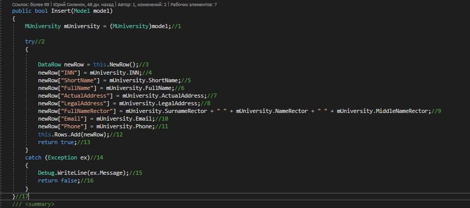
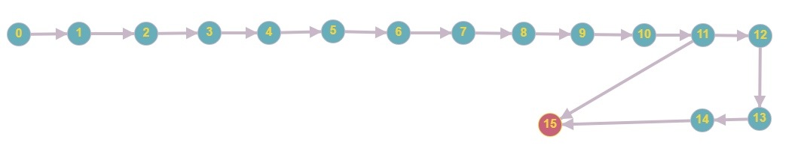

# Тестируемый метод

# Управляющий граф

# Маршруты на основании управляющего графа.

R1 = 0 - 1 - 2 - 3 - 4 - 5 - 6 - 7 - 8 - 9 - 10 - 11 - 15

R2 = 0 - 1 - 2 - 3 - 4 - 5 - 6 - 7 - 8 - 9 - 10 - 12 - 13 - 14 - 15  

# Тестовые сценарии
|Регион|Тест ID|Идея теста|Предварительное условие|Входные параметры|Ожидаемый результат|
| --- | --- | --- | --- | --- | --- |
|R1||||||
