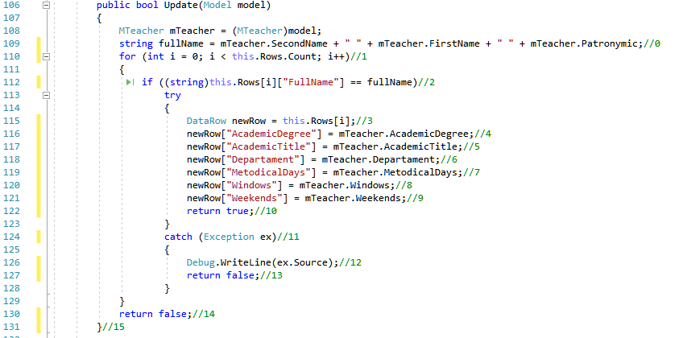
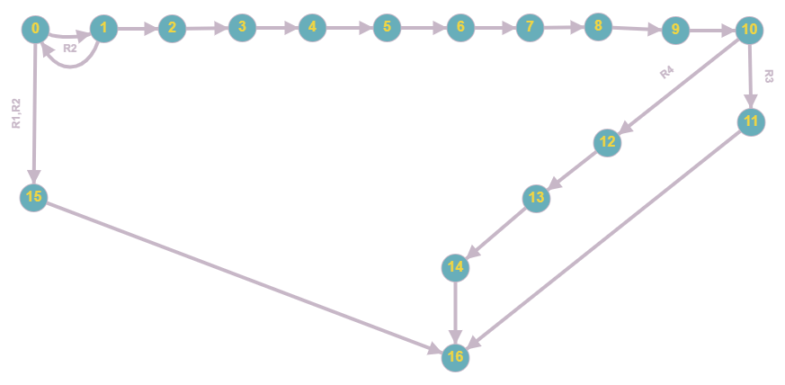

# Тестируемый метод

# Управляющий граф

# Маршруты на основании управляющего графа.

R1 = 0 - 1 - 18

R2 = 0 - 2 - 17 - 18

R3 = 0 - 2 - 3 - 2 - 17 - 18

R4 = 0 - 2 - 3 - 4 - 5 - 6 - 7 - 8 - 9 - 10 - 11 - 12 - 13 - 18

R5 = 0 - 2 - 3 - 4 - 5 - 6 - 7 - 8 - 9 - 10 - 11 - 12 - 14 - 15 - 16 - 18

# Тестовые сценарии
|Регион|Тест ID|Идея теста|Предварительное условие|Входные параметры|Ожидаемый результат|
| --- | --- | --- | --- | --- | --- |
|R1|1245_XXX|Атрибут Группа не задан |group = "17-ИСбо-2а", totalHours =  "100", Discipline = "Правоведение", teacher =  "Иванов Иван Иванович", occupation =  "Лекция", distributed = "20"| Поле "Группа" не задана |недостижим|
|R2|1245_1|Изменить сведения в пустой таблице| таблица академической нагрузки пуста | group = "Валидные данные"; Discipline = "Валидные данные"; Distributed = "Валидные данные"; Occupation = "Валидные данные"; Teacher = "Валидные данные"; TotalHours = "Валидные данные"|false|
|R3|1245_2|Изменить несуществующую группу в заполненной таблице|group = "17-ИСбо-2а", totalHours =  "100", Discipline = "Правоведение", teacher =  "Иванов Иван Иванович", occupation =  "Лекция", distributed = "20"| Поле "группа" в изменяемой нагрузке не соответствует ни одной записи в таблице нагрузка  group = "17-исбо-4ф"totalHours =  "100", Discipline = "Правоведение", teacher =  "Иванов Иван Иванович", occupation =  "Лекция", distributed = "20"|true|
|R4|1245_3|Ввод корректных данных|group = "17-ИСбо-2а", totalHours =  "100", Discipline = "Правоведение", teacher =  "Иванов Иван Иванович", occupation =  "Лекция", distributed = "20"| Discipline = "Операционные системы"; Distributed = "30"; Occupation = "Практическая работа"; Teacher = "Аристархов Валерий Аристархович"; TotalHours = "120";|true|
|R5|1245_4|Атрибут "Группа" дублирует уже существующий атрибут "Группа" |group = "17-ИСбо-2а", totalHours =  "100", Discipline = "Правоведение", teacher =  "Иванов Иван Иванович", occupation =  "Лекция", distributed = "20"| group = "17-ИСбо-2а" Discipline  = "Правоведение" Distributed = "Валидные данные"; Occupation = "Валидные данные"; Teacher = "Валидные данные"; TotalHours = "Валидные данные"|true|
|R5|1245_5|Ввод несуществующей дисциплины |group = "17-ИСбо-2а", totalHours =  "100", Discipline = "Правоведение", teacher =  "Иванов Иван Иванович", occupation =  "Лекция", distributed = "20"| Discipline  = "Цукенгшщзх" Distributed = "Валидные данные"; Occupation = "Валидные данные"; Teacher = "Валидные данные"; TotalHours = "Валидные данные"|true|
|R5|1245_6|Ввод несуществующего преподавателя |group = "17-ИСбо-2а", totalHours =  "100", Discipline = "Правоведение", teacher =  "Иванов Иван Иванович", occupation =  "Лекция", distributed = "20"| Discipline  = "Правоведение" Distributed = "Валидные данные"; Occupation = "Валидные данные"; Teacher = "Цукеке Укее Уке"; TotalHours = "Валидные данные"|true|
|R5|1245_7|Ввод несуществующего типа занятия |group = "17-ИСбо-2а", totalHours =  "100", Discipline = "Правоведение", teacher =  "Иванов Иван Иванович", occupation =  "Лекция", distributed = "20"| group = "17-ИСбо-2а" Discipline  = "Правоведение" Distributed = "Валидные данные"; Occupation = "Йцук"; Teacher = "Валидные данные"; TotalHours = "Валидные данные"|true|

Вывод: Метод Update либо обновляет данные в таблице, либо не обновляет их, по какой-то причине. Тестирование “белый ящик”, позволяет проверить оба варианта работы метода, но большинство ошибок происходит из-за проблем с вводимыми данными и поэтому необходимо несколько однотипных тестов, реализующих добавление разных вариантов данных. Поэтому число тестов, для проверки функционала может быть значительным.
Много тестов недостижимо благодаря проверок на правильность ввода полей.
Тестов может быть намного больше если мы будем менять данные которые проверяем