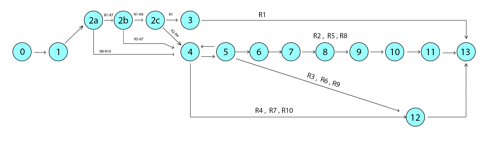

# Тестируемый метод

# Управляющий граф

# Маршруты на основании управляющего графа.

R1 = 0 - 1 - 2 - 4 - 5 - 6 - 7 - 8 - 9 - 10 - 11 - 13

R2 = 0 - 1 - 2 - 3 - 13

R3 = 0 - 1 - 2 - 4 - 12 - 13

# Таблица тестирования 

| Test ID | Test title | Input model | Expected result | Actual result | Test status (Passed/Failed)|
| --- | --- | --- | --- | --- | --- |
| R1 | Correct input values | “Fullname”:“Математика" "Shortname":"Физ." "CycleOfDiscipline":"33" | true | true | Passed |
| R2 | Attempt to enter null values | “Fullname”: null "Shortname": null "CycleOfDiscipline":null | false | false | Passed |
| R3 | Attempt to update doesn’t exist | “Fullname”:“Абвг” "Shortname":"Физ." "CycleOfDiscipline":"33" | false | false | Passed|

# Вывод

Метода тестирования “Белый ящик” помог более наглядно рассмотреть структуры построения дисциплины и стал полезен для тщательного тестирования и обнаружения проблем. 
Оптимизация кода стала более легкой и тестирование прошло успешно.

