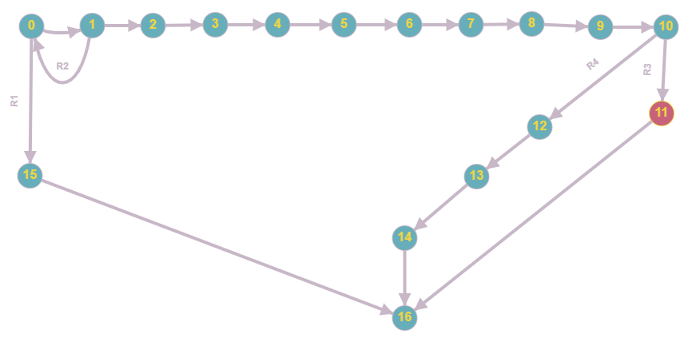

# Тестируемый метод

# Управляющий граф

# Маршруты на основании управляющего графа.

R1 = 0 - 15 -16 

R2 = 0 - 1 - 0 - 15 -16 

R3=0 - 1 - 2 - 3 - 4 - 5 - 6 - 7 - 8 - 9 - 10 - 11 - 16

R4= 0 - 1 - 2 - 3 - 4 - 5 - 6 - 7 - 8 - 9 - 10 - 12 - 13 - 14 -16

# Тестовые сценарии
|Регион|	Тест ID|Идея теста	|Предварительное условие|Входные параметры|Ожидаемый результат|
| --- | --- | --- | --- | --- | --- |
|R1|250_1|Изменить сведения в пустой таблице |Таблица групп пуста |Данные - валидны|true|
|R2|250_2|Изменить несуществующую группу в заполненной таблице |group = "17-ММЭбо-2б",semester = 2, specialty = "ММЭ", shift = 2, students = 2, minNumberOfClass = 1, maxNumberOfClass = 1, weekends = "Воскресенье" ( и еще 4 различные валидные записи )| mGroup.Group != (string)this.Rows[i]["Group"] Остальные данные - валидны |false|
|R3|250_3|Ввод корректных данных, при условии, что Направление подготовки дублирует "Направление подготовки существующего экземпляра"|group = "17-ММЭбо-2б",semester = 2, specialty = "ММЭ", shift = 2, students = 2, minNumberOfClass = 1, maxNumberOfClass = 1, weekends = "Воскресенье|"Specialty = "ММЭ"  Остальные данные - валидны|true|
|R3|250_4|Ввод корректных данных, при условии, что Смена дублирует "Смена существующего экземпляра"|group = "17-ММЭбо-2б",semester = 2, specialty = "ММЭ", shift = 2, students = 2, minNumberOfClass = 1, maxNumberOfClass = 1, weekends = "Воскресенье|"Shift = 2  Остальные данные - валидны|true|
|R3|250_5|Ввод корректных данных, при условии, что Студентов дублирует "Студентов существующего экземпляра"|group = "17-ММЭбо-2б",semester = 2, specialty = "ММЭ", shift = 2, students = 2, minNumberOfClass = 1, maxNumberOfClass = 1, weekends = "Воскресенье|"Students = 2  Остальные данные - валидны|true|
|R3|250_6|Ввод корректных данных, при условии, что График работы дублирует "График работы существующего экземпляра"|group = "17-ММЭбо-2б",semester = 2, specialty = "ММЭ", shift = 2, students = 2, minNumberOfClass = 1, maxNumberOfClass = 1, weekends = "Воскресенье"|MaxNumberOfClass = 1  MinNumberOfClass = 1  Остальные данные - валидны|true|
|R4|250_7|Ввод корректных данных при условии что она будет дублировать другую запись (кроме первичного ключа) (невозможно изменение)|group = "17-ММЭбо-2б",semester = 2, specialty = "ММЭ", shift = 2, students = 2, minNumberOfClass = 1, maxNumberOfClass = 1, weekends = "Воскресенье|semester = 2, specialty = "ММЭ", shift = 2, students = 2, minNumberOfClass = 1, maxNumberOfClass = 1, weekends = "Воскресенье|false|

Вывод: Метод Update либо обновляет данные в таблице, либо не обновляет их, по какой-то причине. Тестирование “белый ящик”, позволяет проверить оба варианта работы метода, но большинство ошибок происходит из-за проблем с вводимыми данными и поэтому необходимо несколько однотипных тестов, реализующих добавление разных вариантов данных. Поэтому число тестов, для проверки функционала может быть значительным.
