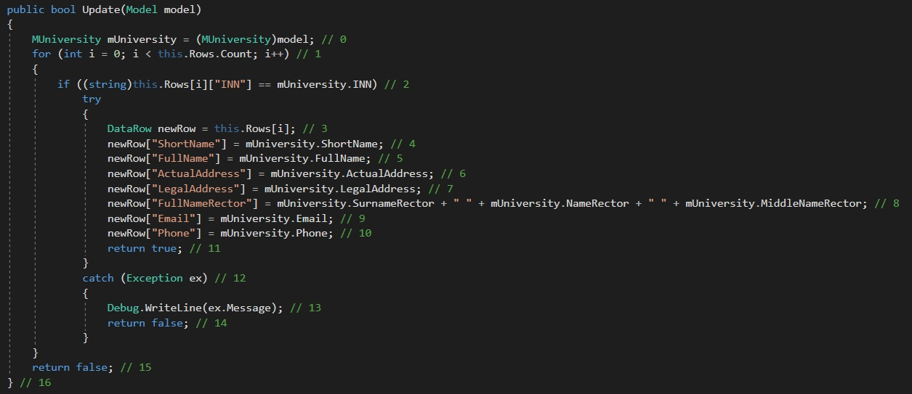
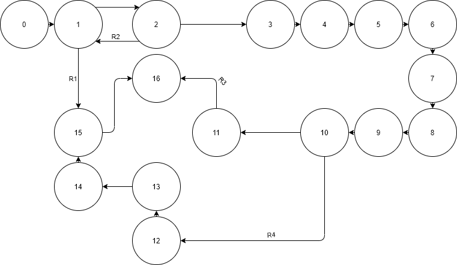

# Тестируемый метод

# Управляющий граф

# Маршруты на основании управляющего графа.

R1 = 0-1-2-15-16

R2 = 0-1-2-1-15-16

R3 = 0-1-2-3-4-5-6-7-8-9-10-11-16

R4 = 0-1-2-3-4-5-6-7-8-9-10-12-13-14-15-16

# Тестовые сценарии
|Регион|Test ID|Идея теста|Предварительное условие|Входные параметры|Ожидаемый результат|
| --- | --- | --- | --- | --- | --- |
|R1|497_1|Изменить сведения в пустой таблице| Таблица институтов пуста | INN = "4401006211", ShortName = "КГТУ", FullName =  ActualAdres = "Костромской Государственный Технический Университет", LegalAdres = "156005, Костромская область, г. Кострома.", "156005, Костромская область, г. Кострома.", NameRector = "Александр", SurnameRector = "Наумов", MiddleNameRector = "Сергеевич", email = "informacia@ksu.edu.ru", phone = "84959391244" | false |
|R2|497_2|Изменить несуществующий университет|INN = "4401006211", ShortName = "КГТУ", FullName =  ActualAdres = "Костромской Государственный Технический Университет", LegalAdres = "156005, Костромская область, г. Кострома.", "156005, Костромская область, г. Кострома.", NameRector = "Александр", SurnameRector = "Наумов", MiddleNameRector = "Сергеевич", email = "informacia@ksu.edu.ru", phone = "84959391244"| INN = "66666666", ShortName = "КГТУ", FullName =  ActualAdres = "Костромской Государственный Технический Университет", LegalAdres = "156005, Костромская область, г. Кострома.", "156005, Костромская область, г. Кострома.", NameRector = "Александр", SurnameRector = "Наумов", MiddleNameRector = "Сергеевич", email = "informacia@ksu.edu.ru", phone = "84959391244" | false|
|R3|497_3|Обновление корректной строки|INN = "4401006211", ShortName = "КГТУ", FullName =  ActualAdres = "Костромской Государственный Технический Университет", LegalAdres = "156005, Костромская область, г. Кострома.", "156005, Костромская область, г. Кострома.", NameRector = "Александр", SurnameRector = "Наумов", MiddleNameRector = "Сергеевич", email = "informacia@ksu.edu.ru", phone = "84959391244" | INN = "4401006211", ShortName = "КГТУ", FullName =  ActualAdres = "Костромской Государственный Технический Университет", LegalAdres = "156005, Костромская область, г. Кострома.", "156005, Костромская область, г. Кострома.", NameRector = "Александр", SurnameRector = "Наумов", MiddleNameRector = "Сергеевич", email = "informacia@ksu.edu.ru", phone = "89999641203" |true|
|R4|497_4|Обновление данных при условии, что ИНН дублирует ИНН существующего университета| INN = "4401006211", ShortName = "КГТУ", FullName =  ActualAdres = "Костромской Государственный Технический Университет", LegalAdres = "156005, Костромская область, г. Кострома.", "156005, Костромская область, г. Кострома.", NameRector = "Александр", SurnameRector = "Наумов", MiddleNameRector = "Сергеевич", email = "informacia@ksu.edu.ru", phone = "84959391244" | INN = "4401006266", ShortName = "КГТУ", FullName =  ActualAdres = "Костромской Государственный Технический Университет", LegalAdres = "156005, Костромская область, г. Кострома.", "156005, Костромская область, г. Кострома.", NameRector = "Александр", SurnameRector = "Наумов", MiddleNameRector = "Сергеевич", email = "informacia@ksu.edu.ru", phone = "84959391244" |false|

# Вывод
Вывод: Метод Update либо обновляет данные в таблице, либо не обновляет их, по какой-то причине. Тестирование “белый ящик”, позволяет проверить оба варианта работы метода, но большинство ошибок происходит из-за проблем с вводимыми данными и поэтому необходимо несколько однотипных тестов, реализующих добавление разных вариантов данных. Поэтому число тестов, для проверки функционала может быть значительным.
