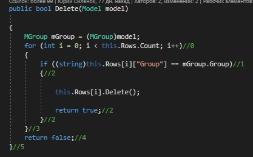
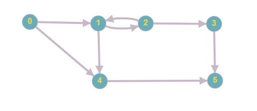

# Тестируемый метод

# Управляющий граф

# Маршруты на основании управляющего графа.

R1 = 0 - 4 - 5

R2 = 0 - 1 - 2 - 3 - 5

R3 = 0 - 1 - 2 - 1 - 4 - 5 

# Тестовые сценарии
|Регион|Тест ID|Идея теста|Предварительное условие|Входные параметры|Ожидаемый результат|
| --- | --- | --- | --- | --- | --- |
|R1|248_1|Удалить существующие данные | Таблица заполнена "17-ИСбо-1в", 2, "ИС", 2, 13, 1, 4, "Воскресенье" |"17-ИСбо-1в", 2, "ИС", 2, 13, 1, 4, "Воскресенье" | true |
|R2|248_2|Удалить несуществующие данные | Таблица заполнена "17-ИСбо-1в", 2, "ИС", 2, 13, 1, 4, "Воскресенье" |"17-ИСбо-1в", 1, "ИСиТ", 1, 1, 0, 0, "Воскресенье" | false |

