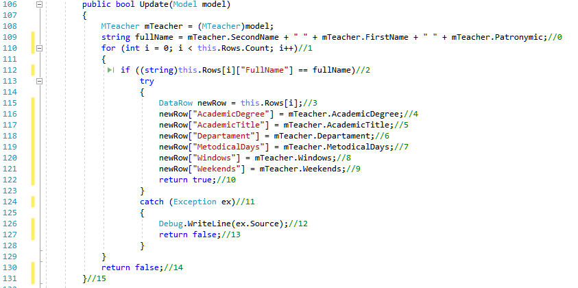
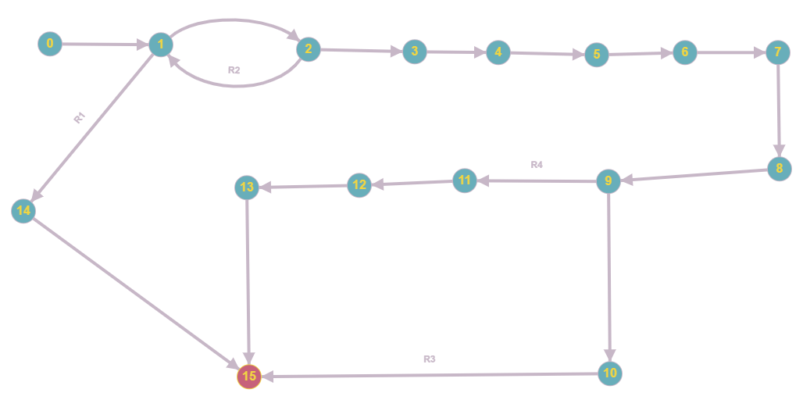

# Тестируемый метод

# Управляющий граф

# Маршруты на основании управляющего графа.

R1 = 0 - 1 - 14 - 15 

R2 = 0 - 1 - 2 - 1 - 14 - 15 

R3=0 - 1 - 2 - 3 - 4 - 5 - 6 - 7 - 8 - 9 - 10 - 15

R4= 0 - 1 - 2 - 3 - 4 - 5 - 6 - 7 - 8 - 9 - 11 - 12 - 13 - 15

# Тестовые сценарии
|Регион|Тест ID|Идея теста|Предварительное условие|Входные параметры|Ожидаемый результат|
| --- | --- | --- | --- | --- | --- |
|R1|247_1|Изменить сведения в пустой таблице |таблица преподавателей пуста | AcademicDegree = "Валидные данные"; AcademicTitle = "Валидные данные"; MetodicalDays = "Валидные данные"; Departament = "Валидные данные"; Teacher = "Валидные данные"; Windows = "Валидные данные" Weekends = "Валидные данные"|false|
|R2|247_2|Изменить несуществующего преподавателя | FirstName = "Садовская", SecondName "Ольга", Patronymic = "Борисовна" AcademicDegree = "КН"; AcademicTitle = "Доц"; MetodicalDays = "Пн, Вт";  Windows = "Ср, Чт, Пт" Weekends = "Вс"|Поле "полное имя" в изменяемой таблице не соответствует ни одной записи в таблице  AcademicDegree = "Валидные данные"; AcademicTitle = "Валидные данные"; MetodicalDays = "Валидные данные"; Departament = "Валидные данные"; Teacher = "Валидные данные"; Windows = "Валидные данные" Weekends = "Валидные данные" |false|
|R3|247_3|Ввод коректных данных, при условии, что они не дублируют данные других экземпляров|FirstName = "Садовская", SecondName "Ольга", Patronymic = "Борисовна" AcademicDegree = "КН"; AcademicTitle = "Доц"; MetodicalDays = "Пн, Вт";  Windows = "Ср, Чт, Пт" Weekends = "Вс"|FirstName = "Садовская", SecondName "Ольга", Patronymic = "Борисовна AcademicDegree = "ДН"; Departament = "ИВТ"; AcademicTitle = "Проф"; MetodicalDays = "Чт, Сб";  Windows = "Сб, Пн" Weekends = "Пт"|true|
|R4|247_4| Ввод корректных данных, при условии, что вводимая ученая степень преподавателя не существует|AcademicDegree = "КН"; AcademicTitle = "Доц"; MetodicalDays = "Пн, Вт";  Windows = "Ср, Чт, Пт" Weekends = "Вс"|AcademicDegree = "П"; AcademicTitle = "Доц"; MetodicalDays = "Пн, Вт";  Windows = "Ср, Чт, Пт" Weekends = "Вс"|false|
|R4|247_5|Ввод корректных данных, при условии, что вводимое ученое звание преподавателя не существует|AcademicDegree = "КН"; AcademicTitle = "Доц"; MetodicalDays = "Пн, Вт";  Windows = "Ср, Чт, Пт" Weekends = "Вс"|AcademicDegree = "КН"; AcademicTitle = "П"; MetodicalDays = "Пн, Вт";  Windows = "Ср, Чт, Пт" Weekends = "Вс"|false|

Вывод: Метод Update либо обновляет данные в таблице, либо не обновляет их, по какой-то причине. Тестирование “белый ящик”, позволяет проверить оба варианта работы метода, но большинство ошибок происходит из-за проблем с вводимыми данными и поэтому необходимо несколько однотипных тестов, реализующих добавление разных вариантов данных. Поэтому число тестов, для проверки функционала может быть значительным.
