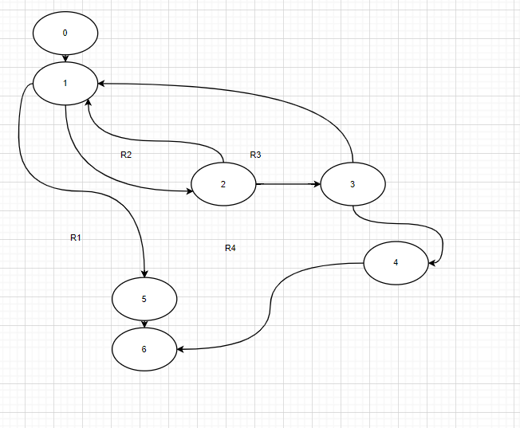

# **Тестируемый метод**  

# **Управляющий граф**  

# **Маршруты на основании управляющего графа**  
R1:0-1-5-6
  
R2:0-1-2-1-6  
  
R3:0-1-2-3-1-5-6 
  
R4:0-1-2-3-4-6
  
# **Таблица тестирования**  
|  Регион| Идентификатор теста | Идея теста |Предварительное условие|  Входные параметры|Ожидаемый результат| 
| ---| ---| ---  |--- | ---| ---| 
| R1  |  DCTitle_1 | Удаление ученой степени из пустой таблицы | Таблица пустая | "Ученая степень": "Кандидат технических наук";   "Сокращенное название ученой степени": "к.т.н."| false| 
| R2  |  DCTitle_2 |  Удаление учетной степени при сооблюдении условия запрос совпадает с имеющимися значениями полного наименования при условии отсутствия алгоритма удаления  |"Ученая степень": "Кандидат технических наук";  "Сокращенное название ученой степени": "к.т.н." | "Ученая степень": "Кандидат технических наук";  "Сокращенное название ученой степени": "к.т.н."| false| 
| R3  |  DCTitle_3 | Удаление учетной степени при сооблюдении условия запрос совпадает с имеющимися значениями как сокращенного названия так и полного при условии отсутствия алгоритма удаления  |"Ученая степень": "Кандидат технических наук";  "Сокращенное название ученой степени" "к.т.н." | "Ученая степень": "Кандидат технических наук";  "Сокращенное название ученой степени" "к.т.н."| false| 
| R4  |  DCTitle_4 |  Удаление учетной степени при совпадающих значениях  |"Ученая степень": "Кандидат технических наук"   "Сокращенное название ученой степени" "к.т.н." | "Ученая степень": "Кандидат технических наук";   "Сокращенное название ученой степени": "к.т.н."| true| 
# Вывод   
Метод Delete может удалить или не удалить данные из таблицы - это зависит от входных данных. Тестирование “белым ящиком” позволяет проверить оба варианта метода. Большинство ошибок возникает из-за вводимых данных, поэтому требуется несколько однотипных тестов, проверяющих совпадение данных в таблице и входных данных.
